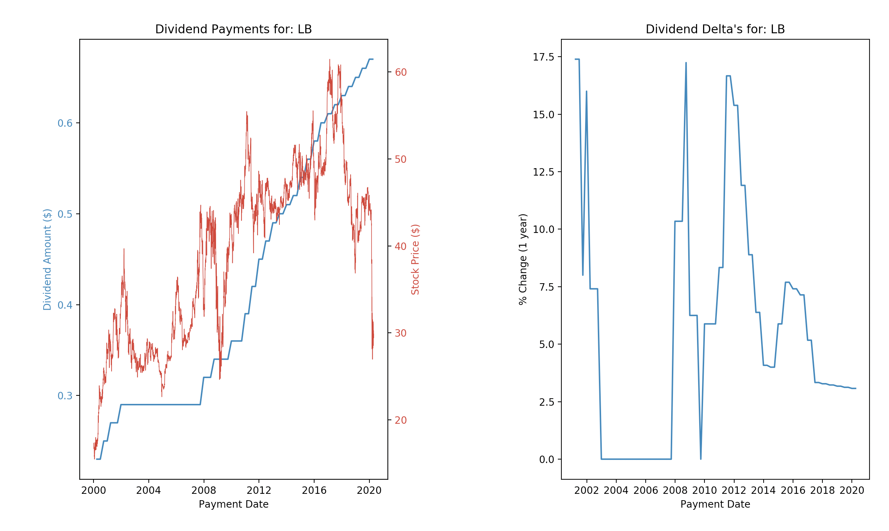
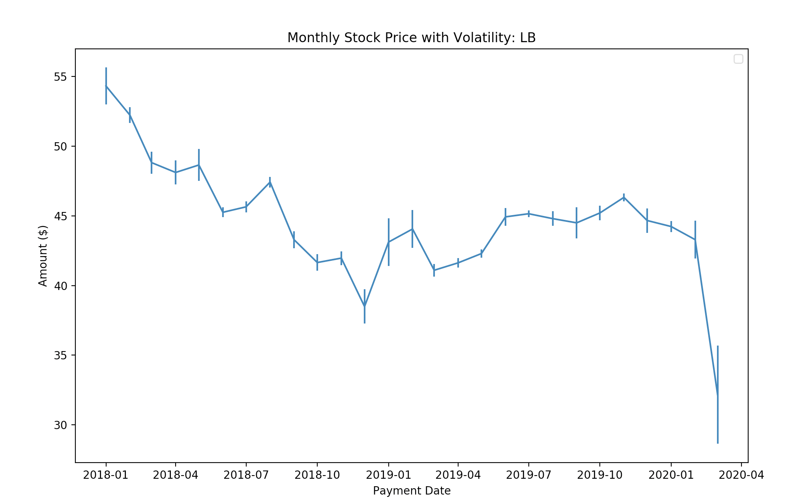

# Tools for Analyzing Stocks

### Usage
Run: `python src/main.py --ticker lb --start-date 2018-01-01`
* `lb` is the ticker for Laurentian Bank on the TSX (only supported exchange so far)
* `2018-01-01` is the date which the plots will start at

### Plots Generated
#### Dividend Information

#### Volatility Information

#### TODO
* Would be nice to have the current dividend yield in the title
* Complete the American Stocks integration
    * Generate an API token from [AlphaVantage](https://www.alphavantage.co/support/#api-key) and put that in a `keys.json` file
    * To run: `python src/stock_scraper.py --ticker TICKER` where ticker could be td.to
    * Cheers